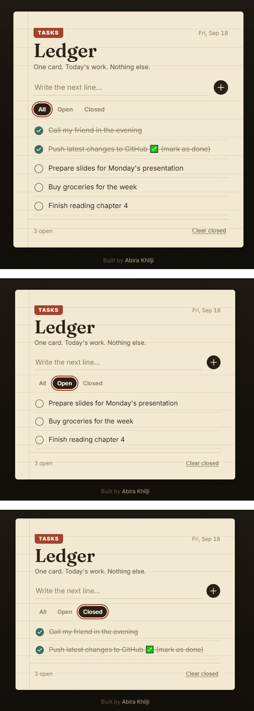

<div align="center">

# 🗂️ Ledger

### A task tracker that looks like one index card on a desk — not another rounded SaaS card.

[](#)
[](#)
[](#)

**[🔗 Live demo] https://ledgerdo.netlify.app/ **[📦 Source](https://github.com/abirakhilji/ledger)**

</div>

---

## Why this exists

Most todo-app tutorials produce the same result: a white card, a shadow, three rounded buttons. **Ledger** started from a different question — *what does a to-do list actually feel like when someone still uses paper for it?* The answer was an index card: ruled lines, a library tab, an ink-stamp checkbox.

It's dependency-free — no React, no build tooling, nothing to `npm install`. Just HTML, CSS and JavaScript.

## Features

- **Add tasks** — type and hit enter, no modal
- **Mark done** — one click toggles a hand-stamped checkmark
- **Edit inline** — click any task's text and start typing
- **Delete** — appears on hover, one click removes it
- **Filter** — switch between All / Open / Closed
- **Bulk clear** — clear every closed task in one click
- **Persists** — saved to `localStorage`, survives a refresh
- **Responsive & accessible** — works on mobile, visible keyboard focus, respects reduced-motion

## Run locally

```bash
git clone https://github.com/abirakhilji/ledger.git
cd ledger
```

Open `index.html` in a browser — no install step needed.

## Built with

HTML, CSS, JavaScript — fonts are [Fraunces](https://fonts.google.com/specimen/Fraunces) and [Inter](https://fonts.google.com/specimen/Inter) from Google Fonts.


## Author

**Abira Khilji** · BCA student
[GitHub](https://github.com/abirakhilji) · [LinkedIn](https://linkedin.com/in/abira-khilji-1a8820399)
